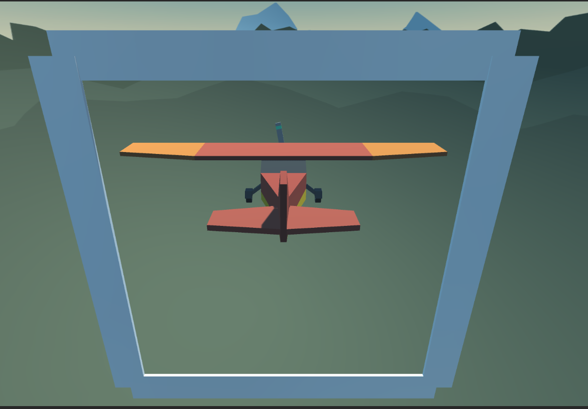

<h3><b>Homework Tasks</b></h3>

 

<ol>
    <li>
    
Rework the script <i>ItemDropper.cs</i> file to work with rigidbody. Don't forget to attach rigidbody and collider to the crate template. Remove redundant ItemFalling.cs component from the project and its usages. 

    </li>
    <li>
    
Add <b>rigidbody</b> to the plane. Change the movement and rotation to be with rigidbody's <b>AddRelativeForce()</b> and <b>AddRelativeTorque()</b> methods.

    </li>
    <li>
    
Create a gate to passes with the plane <i>(see the image "Gate.png" sibling to that file)</i>.

    
    </li>
    <li>
    
Create a script called <i>ColliderDetector.cs</i> and implement the <b>"OnTriggerEnter"</b> method which will detect when to pass the gate then log in to the console "Gate passed!".

    </li>
    <li>
    
In <i>ColliderDetector.cs</i> implement the <b>"OnCollisionEnter"</b> method which will detect when the plane crash on the side of the gate then logs in the console "Plane crashed! Game Over".
    </li>
    <li>
    
<b>[Hard]</b> Raycast forward from the plane. When hitting any collider in the world print in the console "Did Hit {name of the object}". Do that on the "Update" method. You can use that code for help with that task <a href="https://docs.unity3d.com/ScriptReference/Physics.Raycast.html">https://docs.unity3d.com/ScriptReference/Physics.Raycast.html</a> and <a href="https://youtu.be/USwrSUpIgLI">https://youtu.be/USwrSUpIgLI</a> <b>Important! You can see the result from "Debug.DrawRay" only in the Scene window. Cannot see it inside the Game window.</b>

    </li>
</ol>