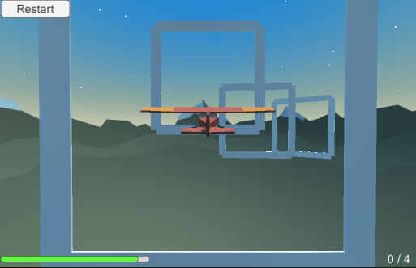
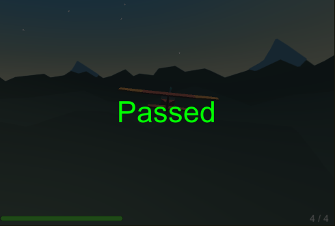
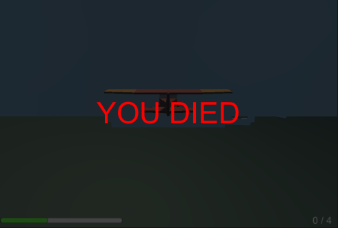

<h3><b>Homework Tasks</b></h3>

 

<ol>
    <li>
    
Create a UI screen space canvas with a slider that indicates a timer. Arrange the timer at the bottom center of the canvas' visible field.

    </li>
    <li>
    
Go to <i>"Assets/Scripts/ColliderDetector.cs"</i> and connect it to the UI script. When player (plane) passing through a gate, adds some amount of time to the UI timer.

    </li>
    <li>
    
Create a new text field. Arrange the text field bottom right corner of the canvas' visible field. Use the text field to count how many gates the plane passes. 

    </li>
    <li>
    
Add an splash screen covering all visible canvas' area. Rename the image's gameobject <b>"GameOverScreen"</b>.

    </li>
    <li>
    
Implement a logic that will show the game over splash screen when:

        <ol style="list-style-type:lower-alpha">
        <li> Crash the plane (implemented in <i>"ColliderDetector.cs"</i>). Show a text "You DIED". Use <i>"Failed.png"</i> for reference.</li>
        <li>The countdown timer is equal to or lower than 0. Show a text "YOU DIED". Use "Failed.png" for reference.</li>
        <li>The player(the plane) passes all gates. Show the text "Passed". Use "Finish.png" for reference.</li>
         
        </ol>
    </li>
    <li>
    
Create a UI button that will restart the game. Arrange the button at the top left corner of the canvas' visible field.

    <b>HINT:</b> 
To restart the game use "UnityEngine.SceneManagement.SceneManager.LoadScene("MainScene");"

    
https://docs.unity3d.com/ScriptReference/SceneManagement.SceneManager.LoadScene.html

    
To make it work is mandatory to add the scene in the BuildSettings.

    </li>
    <li>
    
Fix the UI anchors to all UI elements to prevent disappearing when resizing the game view.

    
<b>HINT:</b> See the example images sibling to that file for more references.

     
    </li>
    
     
    

</ol>